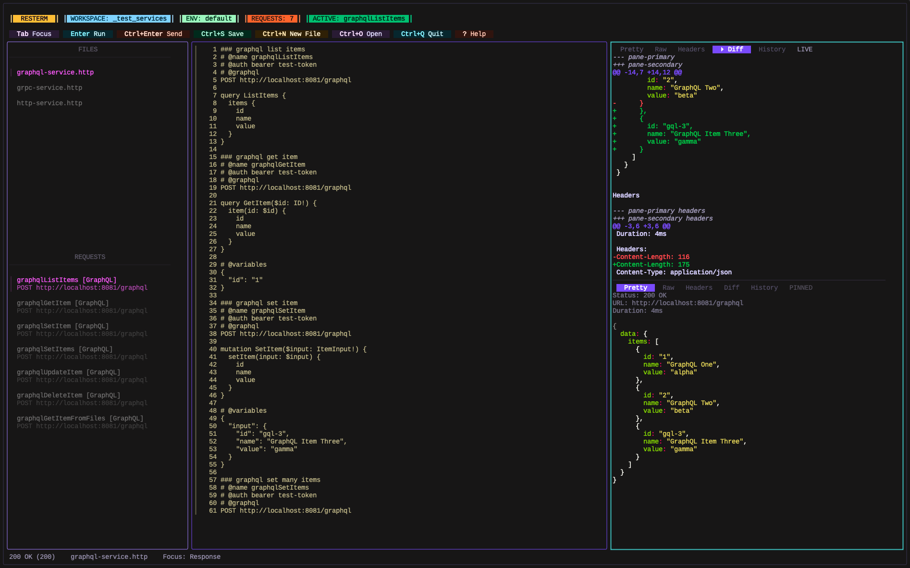

<h1 align="center">Resterm</h1>

<p align="center">
  <em>a terminal-based REST/GraphQL/gRPC client.</em>
</p>

<p align="center">
  
</p>

> [!WARNING]
> Resterm is still in early stages so bugs and undesired behaviors can be expected.

## Overview

Resterm is a terminal-first client for working **HTTP**, **GraphQL**, and **gRPC** services. It pairs a Vim-like-style editor with a workspace explorer, response diff, history and scripting so you can iterate on requests without leaving the keyboard.

## Highlights
- **Editor** with inline syntax highlighting, search (`Ctrl+F`), and clipboard motions.
- **Workspace** navigator that filters `.http` / `.rest` files, supports recursion and keeps request lists in sync as you edit.
- **Inline** requests and curl import for one-off calls (`Ctrl+Enter` on a URL or curl block).
- **Pretty/Raw/Header/Diff/History** views with optional split panes and pinned comparisons.
- **Variable** scopes, captures, JavaScript hooks, and multi-step workflows with per-step expectations and overrides.
- **GraphQL** helpers (`@graphql`, `@variables`, `@query`) and gRPC directives (`@grpc`, `@grpc-descriptor`, reflection, metadata).
- **Built-in** OAuth 2.0 client plus support for basic, bearer, API key, and custom header auth.
- **Latency** with `@profile` to benchmark endpoints and render histograms right inside the TUI.
- **Multi-step workflows** let you compose several named requests into one workflow (`@workflow` + `@step`), override per-step variables, and review aggregated results in History.

## Documentation

The full reference, including request syntax, metadata, directive tables, scripting APIs, transport settings and advanced workflows, lives in [`docs/resterm.md`](./docs/resterm.md).

## Installation

> [!NOTE]
> The install helper uses `curl` and `jq`. Install `jq` with your package manager (`brew install jq`, `sudo apt install jq`, etc.).

### Linux / macOS

```bash
# Detect latest tag
LATEST_TAG=$(curl -fsSL https://api.github.com/repos/unkn0wn-root/resterm/releases/latest | jq -r .tag_name)

# Download the matching binary (Darwin/Linux + amd64/arm64)
curl -fL -o resterm "https://github.com/unkn0wn-root/resterm/releases/download/${LATEST_TAG}/resterm_$(uname -s)_$(uname -m)"

# Make it executable and move it onto your PATH
chmod +x resterm
sudo install -m 0755 resterm /usr/local/bin/resterm
```

### Windows (PowerShell)

```powershell
$latest = Invoke-RestMethod https://api.github.com/repos/unkn0wn-root/resterm/releases/latest
$asset  = $latest.assets | Where-Object { $_.name -like 'resterm_Windows_*' } | Select-Object -First 1
Invoke-WebRequest -Uri $asset.browser_download_url -OutFile resterm.exe
# Optionally relocate to a directory on PATH, e.g.:
Move-Item resterm.exe "$env:USERPROFILE\bin\resterm.exe"
```

### From source

```bash
go install github.com/unkn0wn-root/resterm/cmd/resterm@latest
```

## Quick Start

1. Create or open a directory that contains `.http` / `.rest` files (see `_examples/` for samples).
2. Launch Resterm: `resterm --workspace path/to/project` (or if your .http/.rest file is in the same dir. - just type `resterm` and it will be autodiscovered).
3. Pick a request from the sidebar and press `Ctrl+Enter` to send it. Responses appear in the right pane.
4. Use `Ctrl+E` to switch environments, `Ctrl+G` to inspect captured globals, and `Ctrl+V` / `Ctrl+U` to split the response pane when comparing calls.
5. Move between panes with `Tab` / `Shift+Tab`, jump directly with `g+r` (requests), `g+i` (editor), `g+p` (response), and adjust the editor/response width with `g+h` / `g+l`.

A minimal request file:

```http
### Status check
# @name status
GET https://httpbin.org/status/204
User-Agent: resterm

### Authenticated echo
# @name bearerEcho
# @auth bearer {{auth.token}}
GET https://httpbin.org/bearer
Accept: application/json
```

## Workflows at a Glance

- Combine existing requests with `@workflow` + `@step` blocks to build repeatable scenarios that run inside the TUI.
- Set per-step assertions (`expect.status`, `expect.statuscode`) and pass data between steps via `vars.request.*` and `vars.workflow.*` namespaces.
- View progress in the sidebar, and inspect the aggregated summary in History after the run.
- See [`docs/resterm.md`](./docs/resterm.md#workflows-multi-step-workflows) for the full reference and `_examples/workflows.http` for a runnable sample workflow.

## Quick Configuration Overview

- Environment files: `resterm.env.json` (or legacy `rest-client.env.json`) discovered in the file directory, workspace root, or current working directory.
- CLI flags: `--workspace`, `--file`, `--env`, `--env-file`, `--timeout`, `--insecure`, `--follow`, `--proxy`, `--recursive`.
- Config directory: `$HOME/Library/Application Support/resterm`, `%APPDATA%\resterm`, or `$HOME/.config/resterm` (override with `RESTERM_CONFIG_DIR`).

See the documentation [`docs/resterm.md`](./docs/resterm.md) for a complete breakdown of variable resolution, scripting helpers, history storage, and transport overrides.

## Roadmap
- Command palette & keymap customisation
- Richer response tooling (streaming previews, save-to-file, diffing)
- Better scripting support (shared helpers, setup/teardown, better assertions)
- Themes & layout configuration
- Support more curl flags
