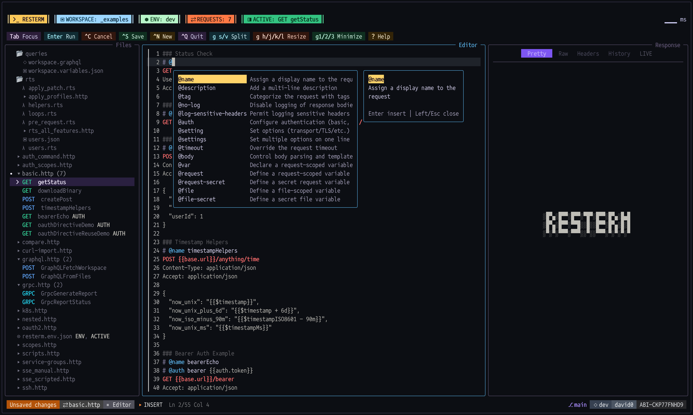
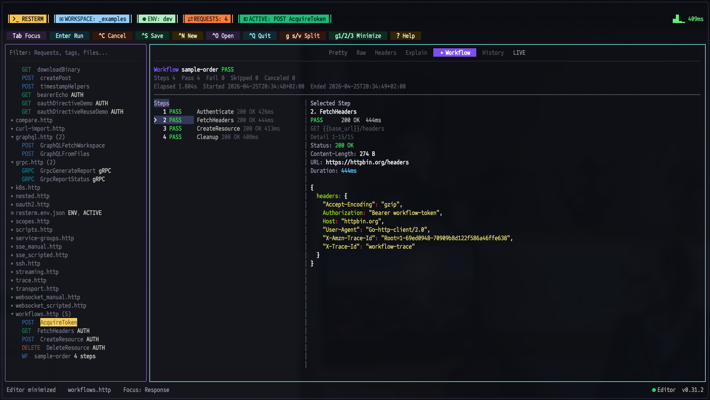
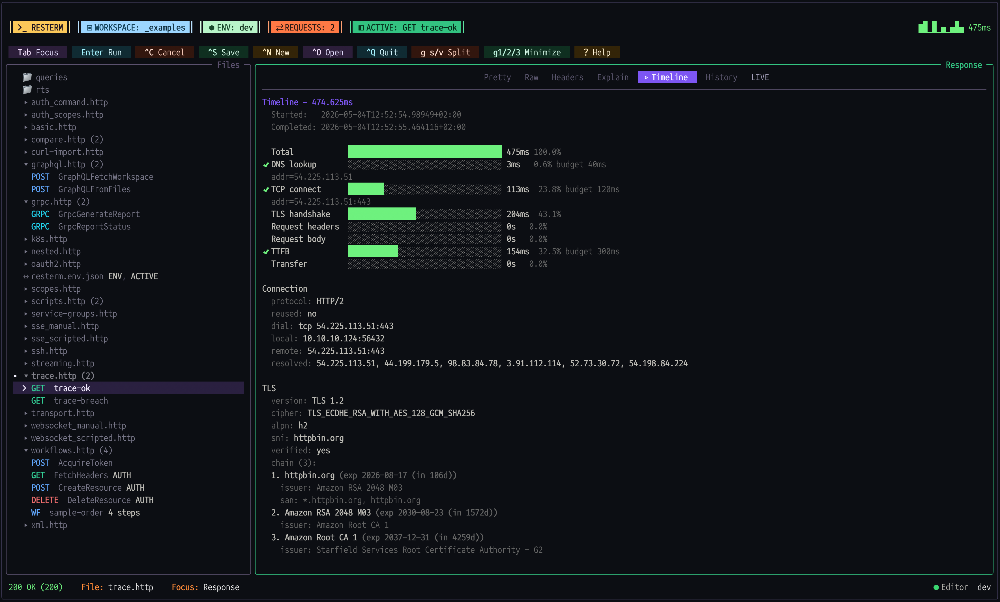
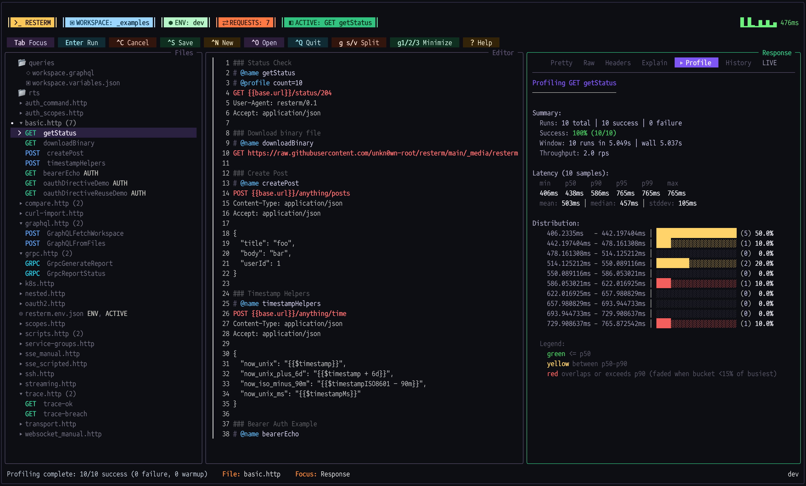
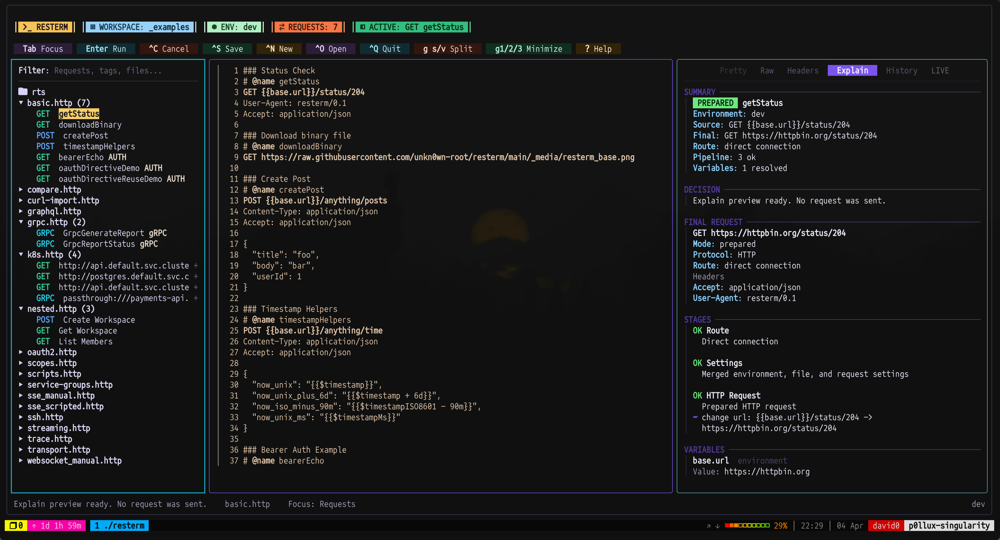
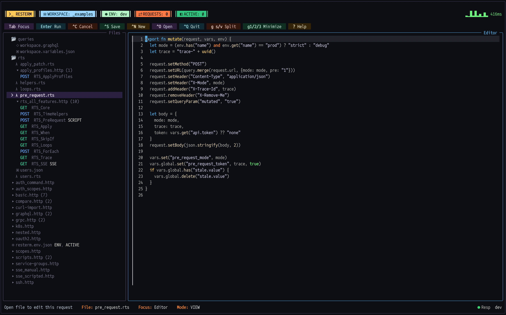
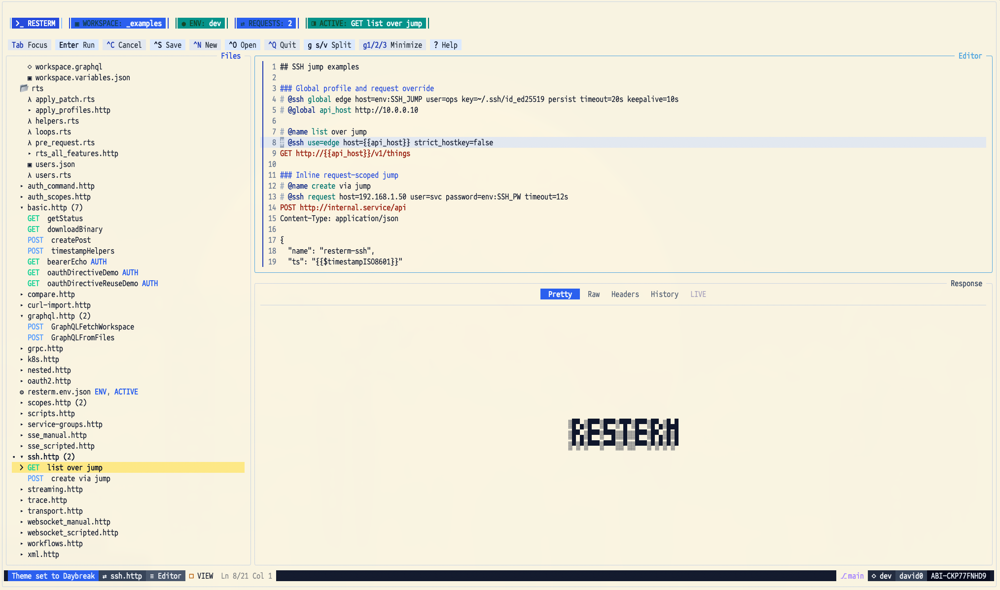

<h1 align="center">
  
  <br>
  Resterm
</h1>

<p align="center">
  <em>A terminal API client for REST, GraphQL, gRPC, WebSocket and SSE.</em>
</p>

<p align="center">
  
</p>

Resterm is a **keyboard-driven** API client that lives in your terminal and keeps everything local. It stores requests as plain files and supports **SSH tunnels**, **Kubernetes port-forwarding**, **OAuth 2.0**, and **command-backed auth**, with a fast feedback loop built around `history`, `diffs`, `tracing`, and `profiling`.

Quick links: [Screenshots](#screenshot-tour), [Installation](#installation), [Quick Start](#quick-start), [Documentation](#documentation).

## Screenshot tour

<details>
<summary>See the UI in action (click to expand)</summary>

<p align="center">
  <strong>Workflows</strong>
</p>

<p align="center">
  
</p>

<p align="center">
  <strong>Trace and Timeline</strong>
</p>

<p align="center">
  
</p>

<p align="center">
  <strong>Profiler</strong>
</p>

<p align="center">
  
</p>

<p align="center">
  <strong>Explain</strong>
</p>

<p align="center">
  
</p>

<p align="center">
  <strong>RestermScript</strong>
</p>

<p align="center">
  
</p>

<p align="center">
  <strong>Light Theme</strong>
</p>

<p align="center">
  
</p>

<p align="center">
  <strong>OAuth browser demo (old UI design)</strong>
</p>

<p align="center">
  
</p>

</details>

## Why Resterm

- **HTTP, GraphQL, gRPC, WebSocket, and SSE** are supported out of the box.
- Requests live in plain `.http` / `.rest` files.
- **File-native automation** - conditional logic (`@when`, `@if`/`@elif`/`@else`, `@for-each`), multi-step workflows (`@workflow` / `@step`), captures, variables and assertions (`@capture`, `@var`, `@assert`).
- **RestermScript** - a small, safe expression language purpose-built for Resterm.
- **Vim-style TUI controls** with familiar motions, `/` search and command-line actions like `:w`, `:q`, `:q!`, `:wq`, `:x`, `:e`, `:help` and `:noh`.
- **OAuth 2.0** (client credentials, password, auth code + PKCE), **command-backed auth** via existing CLIs, **SSH tunnels**, and **Kubernetes port-forwards** are built in - no extra tools.
- **CLI** with `resterm run` for requests, workflows, JSON/JUnit output, and reusable run artifacts.
- **Mock servers** declared in the same files, with conditional scenarios, response interpolation, keyed sequences, call verification, hot reload, and response capture.
- **Timeline tracing**, **profiling**, and **compare runs** across environments.
- **Streaming transcripts** and an interactive console for WebSocket and SSE sessions.
- No cloud sync, no accounts, no telemetry. Everything stays local.
- There is no AI integration and there will never be.

## CLI

Resterm also ships with built-in `resterm run` and `resterm mock` commands.

Use `resterm run` when you want to execute `.http` / `.rest` files directly from the terminal without opening the TUI.

**Example**:

```bash
mkdir my-api && cd my-api
resterm init
resterm run --request Echo requests.http
```

`resterm init` creates `requests.http` with sample requests and `resterm.env.json` with a `dev` environment that points at `httpbin.org`. The command above runs the **Echo** request which POSTs a JSON body and prints the response.

> [!NOTE]
> This is different from the `headless` package. The `headless` package is the embeddable Go API for building your own runner or CI integration, while `resterm run` is the built-in CLI on top of the same execution engine.

See the full [CLI documentation](docs/cli.md) for usage, selectors, output formats, and examples.

## Mock Servers

Resterm can serve HTTP mocks from the same `.http` / `.rest` files as your real requests.

- Match incoming requests by query parameters, headers, or JSON bodies, then select a named or default response.
- Model polling and retry flows with response sequences, including independent cursors for different resources or callers.
- Build responses from path, query, header, and body values, with generators for dynamic data.
- Verify exact call counts with `@expect` or inspect received traffic from RestermScript.
- Hot reload source files and fixtures, with optional TLS support.

Two scenarios on one route look like this:

```http
### Payment accepted
# @mock method=POST path=/payments name=accepted default=true latency=150ms
HTTP/1.1 202 Accepted
Content-Type: application/json

{"id":"pay_123","status":"pending"}

### Payment declined
# @mock method=POST path=/payments name=declined
# @match query={"mode":"decline"} headers={"X-Tenant":"demo"} json={"amount":0}
HTTP/1.1 422 Unprocessable Entity
Content-Type: application/json

{"error":"amount must be positive"}
```

Serve one file or a whole directory from the CLI:

```bash
resterm mock ./requests.http
resterm mock --recursive --addr 127.0.0.1:9090 ./requests
```

See the full [Mock Servers reference](docs/resterm.md#mock-servers), the [`resterm mock` CLI guide](docs/cli.md#resterm-mock), and the [working example](_examples/mocks.http).

## Headless

Resterm ships with the engine API, so you can build your own headless runner for Resterm and embed request execution in your own Go tooling/code, CI or internal automation.

The public Go API lives in the [`headless`](./headless) package and can run requests, workflows, assertions, compare runs and profiles without the TUI.

> [!NOTE]
> If you don't want to build your own runner, check out [resterm-runner](https://github.com/unkn0wn-root/resterm-runner).

## Quick Start

1. Install Resterm (see [Installation](#installation) for install scripts, Windows, and manual installs).

   ```bash
   brew install resterm
   ```

2. Bootstrap a tiny workspace.

   ```bash
   mkdir my-api && cd my-api
   resterm init
   ```

3. Run it and send your first request.

   ```bash
   resterm
   ```

   Press `Ctrl+Enter` in the editor to send the highlighted request.

If you do not want files yet, just run `resterm`, type a URL in the editor, and press `Ctrl+Enter`.
If you already have a curl command, paste it into the editor and press `Ctrl+Enter` to import it.

## Navigation & layout cheat sheet

A few keys that make Resterm feel “native” quickly:

- **Pane focus & layout**
  - `Tab` / `Shift+Tab` - move focus between sidebar, editor, and response.
  - `g+r` - jump to **Requests** (sidebar).
  - `g+i` - jump to **Editor**.
  - `g+p` - jump to **Response**.
  - `g+h` / `g+l` - adjust layout:
    - When the **left pane** (sidebar) is focused: change sidebar width.
    - When editor/response are side-by-side: change editor/response width.
  - `g+j` / `g+k` - adjust layout:
    - When editor/response are stacked: change editor/response height.
    - When the navigator is focused: collapse/expand the selected branch.
  - `g+v` / `g+s` - toggle response pane between inline and stacked layout.
  - `g+1`, `g+2`, `g+3` - minimize/restore sidebar, editor, response.
  - `g+z` / `g+Z` - zoom the focused pane / clear zoom.

- **Environments & globals**
  - `Ctrl+E` - switch environments.
  - `Ctrl+G` - inspect captured globals.

- **Working with responses**
  - `Ctrl+V` / `Ctrl+U` - split the response pane for side-by-side comparison.
  - When response pane is focused:
    - `Ctrl+Shift+C` or `g y` - copy the entire Pretty/Raw/Headers tab
      to the clipboard (no mouse selection needed).
  - `g x` - build an Explain preview for the active request without sending it.
  - `g e` - open the current or selected supported file in your external editor.

---

> [!TIP]
> **If you only remember three shortcuts…**
> - `Ctrl+Enter` - send request
> - `Tab` / `Shift+Tab` - switch panes
> - `g+p` - jump to response

## Installation

**Linux / macOS (Homebrew)**

```bash
brew install resterm
```

> [!NOTE]
> Homebrew installs should be updated with Homebrew (`brew upgrade resterm`). The built-in `resterm --update` command is for binaries installed from GitHub releases or install scripts.

**Linux / macOS (Shell script)**

> [!IMPORTANT]
> Pre-built Linux binaries depend on glibc **2.32 or newer**. If you run an older distro, build from source on a machine with a newer glibc toolchain or upgrade glibc before using the release archives.

```bash
curl -fsSL https://raw.githubusercontent.com/unkn0wn-root/resterm/main/install.sh | bash
```

or with `wget`:

```bash
wget -qO- https://raw.githubusercontent.com/unkn0wn-root/resterm/main/install.sh | bash
```

**Windows (PowerShell)**

```powershell
iwr -useb https://raw.githubusercontent.com/unkn0wn-root/resterm/main/install.ps1 | iex
```

These scripts detect your architecture, download the latest release, and install the binary.

### Manual installation

> [!NOTE]
> The manual install helper uses `curl` and `jq`. Install `jq` with your package manager (`brew install jq`, `sudo apt install jq`, etc.).

**Linux / macOS**

```bash
# Detect latest tag
LATEST_TAG=$(curl -fsSL https://api.github.com/repos/unkn0wn-root/resterm/releases/latest | jq -r .tag_name)

# Download the matching binary (Darwin/Linux + amd64/arm64)
curl -fL -o resterm "https://github.com/unkn0wn-root/resterm/releases/download/${LATEST_TAG}/resterm_$(uname -s)_$(uname -m)"

# Make it executable and move it onto your PATH
chmod +x resterm
sudo install -m 0755 resterm /usr/local/bin/resterm
```

**Windows (PowerShell)**

```powershell
$latest = Invoke-RestMethod https://api.github.com/repos/unkn0wn-root/resterm/releases/latest
$asset  = $latest.assets | Where-Object { $_.name -like 'resterm_Windows_*' } | Select-Object -First 1
Invoke-WebRequest -Uri $asset.browser_download_url -OutFile resterm.exe
# Optionally relocate to a directory on PATH, e.g.:
Move-Item resterm.exe "$env:USERPROFILE\bin\resterm.exe"
```

### From source

```bash
go install github.com/unkn0wn-root/resterm/cmd/resterm@latest
```

## Update

```bash
resterm --check-update
resterm --update
```

The first command reports whether a newer release is available. The second downloads, verifies and installs it in place. On Windows the previous binary is left beside the new one as `resterm.exe.old`.
The next update replaces it once no process is still running the old version.

## Quick Configuration Overview

- Environments are JSON files (`resterm.env.json`) discovered in the request directory, workspace root, or CWD. Dotenv files (`.env`, `.env.*`) are opt-in via `--env-file` and are single-workspace. Prefer JSON when you need multiple environments in one file.
- Config is stored per OS and can be overridden with `RESTERM_CONFIG_DIR`:
  - macOS: `~/Library/Application Support/resterm`
  - Windows: `%APPDATA%\resterm`
  - Linux/Unix: `~/.config/resterm`

## Collections

Export a workspace into a Git-friendly Resterm bundle and import it into another workspace. Bundles carry a `manifest.json` with checksums so imports verify file integrity first, and environment values are replaced with `REPLACE_ME` placeholders on export so secrets stay out of the bundle.

```bash
resterm collection export --workspace ./my-api --out ./shared/my-api-bundle
resterm collection import --in ./shared/my-api-bundle --workspace ./my-local-api
```

Add `--dry-run` to preview an import and `--force` to overwrite existing files intentionally. Docs: [`docs/resterm.md#collection-sharing`](./docs/resterm.md#collection-sharing).

## Inline curl import

Paste a curl command into the editor and press `Ctrl+Enter` to convert it into a structured request. Resterm understands common flags, merges repeated data segments, and keeps multipart uploads intact.

```bash
curl --compressed \
  --url "https://httpbin.org/post?source=resterm" \
  --request POST \
  -H "Accept: application/json" \
  --user resterm:test123 \
  -F file=@README.md
```

If you copied the command from a shell, prefixes like `sudo` or `$` are ignored automatically.

## RestermScript

RestermScript (RTS) is a small expression language built specifically for Resterm. Because it targets Resterm features directly, it can evolve alongside Resterm and stay symbiotic with the request format, workflows, and directives. JavaScript hooks are still available when you want them, but RTS is the default because it is readable, predictable, and focused on Resterm’s domain.

Quick example (RTS module + request):

```rts
// rts/helpers.rts
module helpers
export fn authHeader(token) {
  return token ? "Bearer " + token : ""
}
```

```http
# @use ./rts/helpers.rts
# @when env.has("feature")
# @assert response.statusCode == 200
GET https://api.example.com/users/{{= vars.get("user") }}
Authorization: {{= helpers.authHeader(vars.get("auth.token")) }}
```

Full reference: [`docs/restermscript.md`](docs/restermscript.md).

## Deep dive

#### OAuth 2.0

Resterm supports client credentials, password grant, and authorization code + PKCE. For auth code flows, it opens your system browser, spins up a local callback server on `127.0.0.1`, captures the redirect, and exchanges the code automatically. Tokens are cached per environment and refreshed when they expire. Docs: [`docs/resterm.md#oauth-20-directive`](./docs/resterm.md#oauth-20-directive) and `_examples/oauth2.http`.

#### Workflows and scripting

Chain requests with `@workflow` and `@step`, pass data between steps, and add lightweight JS hooks where needed. Docs + sample: [`docs/resterm.md#workflows-multi-step-workflows`](./docs/resterm.md#workflows-multi-step-workflows) and `_examples/workflows.http`.

#### Compare runs

Run the same request across environments with `@compare` or `--compare`, then diff responses side by side with `g+c`. Docs: [`docs/resterm.md#compare-runs`](./docs/resterm.md#compare-runs).

#### Tracing and timeline

Add `@trace` with budgets to capture DNS, connect, TLS, TTFB, and transfer timings. Resterm visualizes overruns and can export spans to OpenTelemetry. Docs: [`docs/resterm.md#timeline--tracing`](./docs/resterm.md#timeline--tracing).

#### Streaming (WebSocket and SSE)

Use `@websocket` with `@ws` steps or `@sse` to script and record streams. The Stream tab keeps transcripts and includes an interactive console. Docs: [`docs/resterm.md#streaming-sse--websocket`](./docs/resterm.md#streaming-sse--websocket).

#### gRPC

Resterm supports unary and streaming calls with transcripts, metadata, and body expansion for gRPC files. Docs: [`docs/resterm.md#grpc`](./docs/resterm.md#grpc).

#### OpenAPI import

Convert OpenAPI 3 specs into Resterm `.http` collections from the CLI with `--from-openapi`, passing either a local file or an `http(s)` URL (e.g. `--from-openapi https://api.example.com/openapi.json`). Use `--openapi-mode requests`, `mocks`, or `both` to choose generated blocks. Remote fetches respect the global `--insecure` and `--proxy` flags. Docs: [`docs/cli.md#import-examples`](./docs/cli.md#import-examples).

#### Curl import

Convert curl commands into `.http` files from the CLI with `--from-curl`. Docs: [`docs/resterm.md#importing-curl-commands`](./docs/resterm.md#importing-curl-commands).

#### SSH tunnels

Route HTTP, gRPC, WebSocket, and SSE traffic through bastions with `@ssh` profiles. Docs: [`docs/resterm.md#ssh-tunnels`](./docs/resterm.md#ssh-tunnels) and `_examples/ssh.http`.

#### Kubernetes port-forwards

Route HTTP, gRPC, WebSocket, and SSE traffic through Kubernetes with `@k8s` profiles targeting pods/services/deployments/statefulsets. Docs: [`docs/resterm.md#kubernetes-port-forwards`](./docs/resterm.md#kubernetes-port-forwards) and `_examples/k8s.http`.

#### Theming and bindings

Customize colors and keybindings via `themes/*.toml` and `bindings.toml` or `bindings.json` under the config directory. Docs: [`docs/resterm.md#theming`](./docs/resterm.md#theming) and [`docs/resterm.md#custom-bindings`](./docs/resterm.md#custom-bindings).

## Documentation

- [`docs/resterm.md`](./docs/resterm.md) - the full reference: request syntax, directives, scripting and transports.
- [`docs/cli.md`](./docs/cli.md) - the command-line guide: `resterm run`, importers, collections and history.
