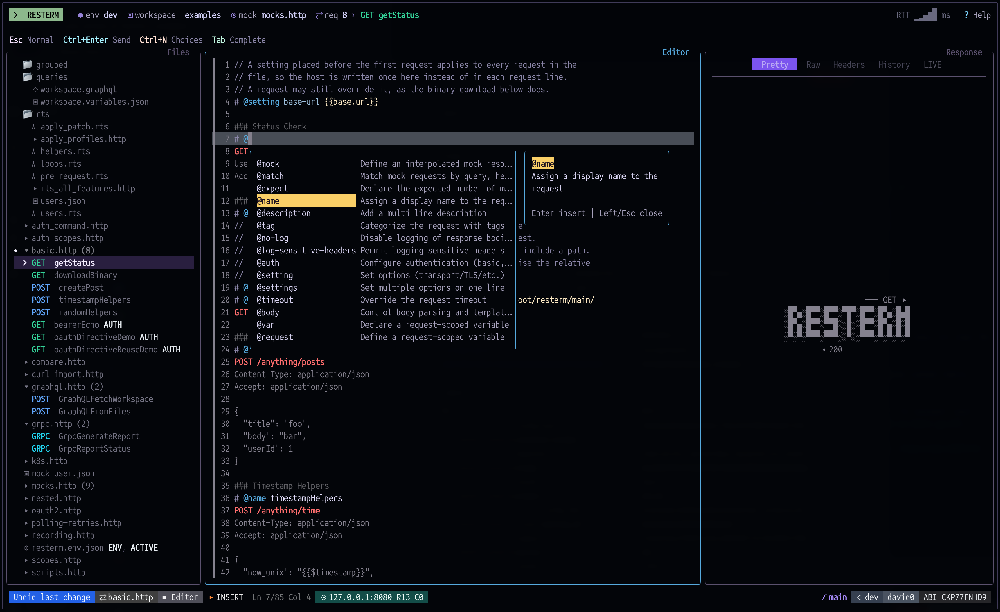
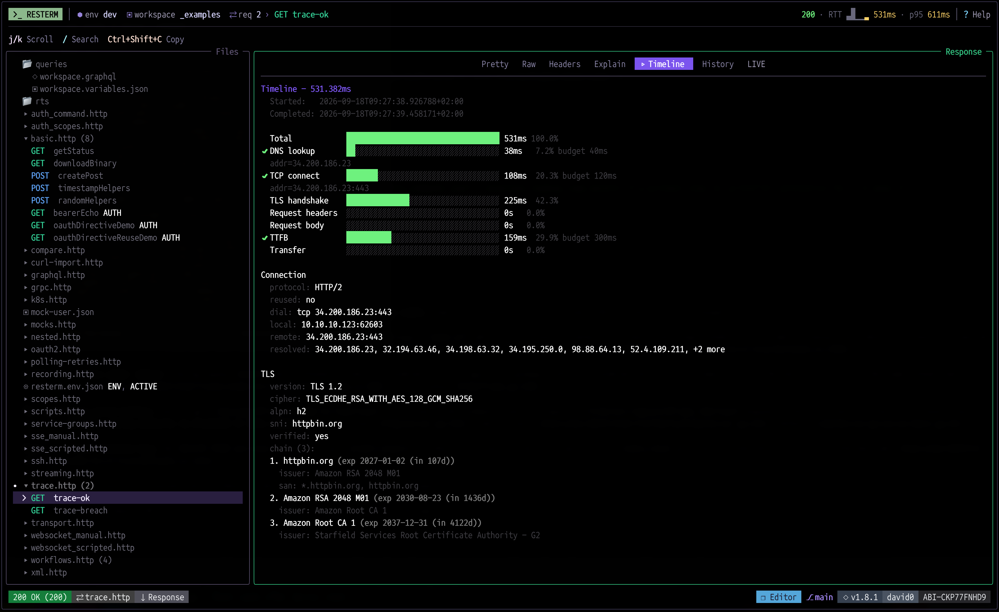
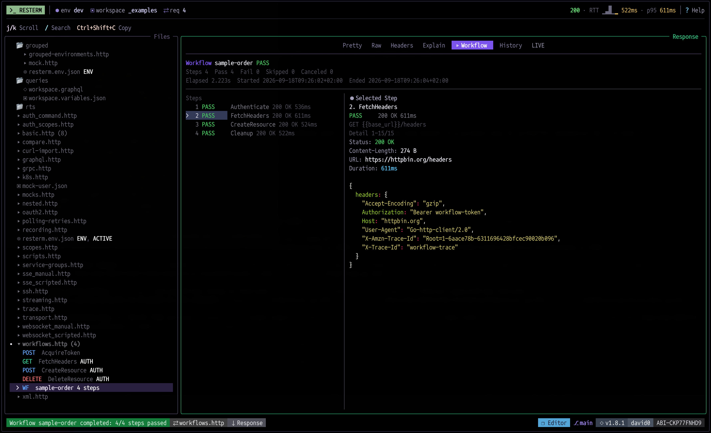
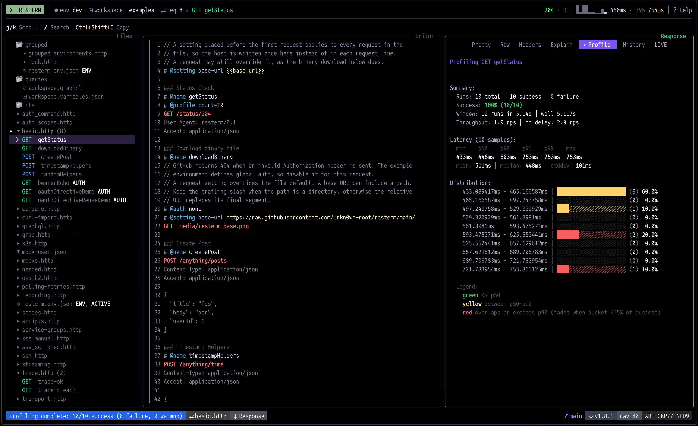
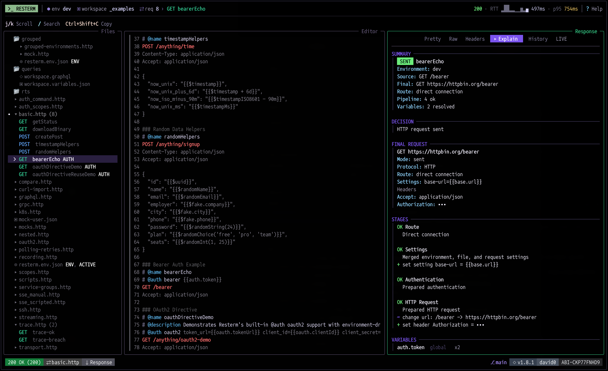
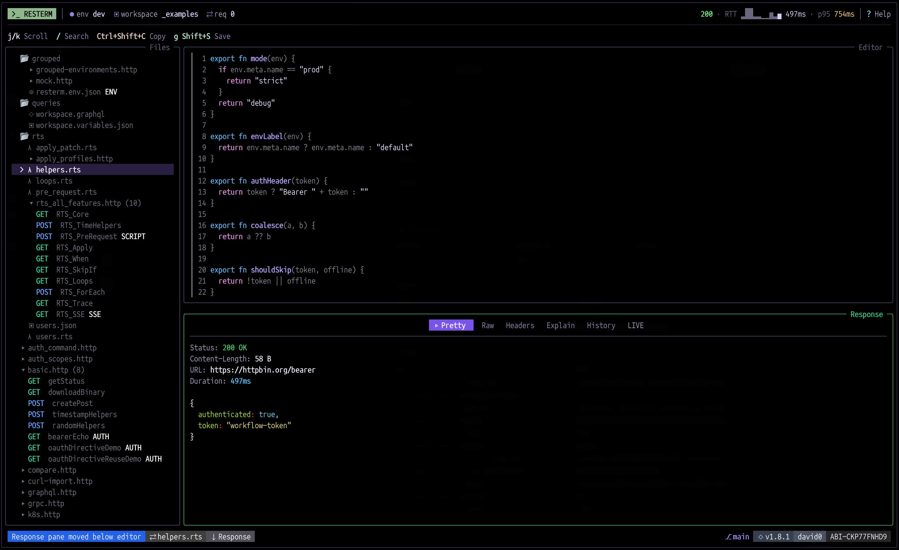

<h1 align="center">
  
  <br>
  Resterm
</h1>

<p align="center">
  <em>An API-as-code workbench for the terminal.</em>
  <br>
  <a href="https://resterm.app">resterm.app</a> · <a href="https://resterm.app/docs/">Documentation</a>
</p>

<p align="center">
  
</p>

<p align="center">
  
  <br>
  <sub>Trace and timeline view</sub>
</p>

Resterm is an API client that stores requests in plain `.http` and `.rest` files that can live side by side in your repo like the rest of your code. You can use the terminal UI, or run the same files in CI with `resterm run`.

Quick links: [Screenshots](#screenshots), [Install](#install), [Quick start](#quick-start), [Request files](#request-files), [Documentation](#documentation).

## Screenshots

<details>
<summary>See the UI in action (click to expand)</summary>

<p align="center">
  <strong>Workflows</strong>
</p>

<p align="center">
  
</p>

<p align="center">
  <strong>Profiler</strong>
</p>

<p align="center">
  
</p>

<p align="center">
  <strong>Explain</strong>
</p>

<p align="center">
  
</p>

<p align="center">
  <strong>RestermScript</strong>
</p>

<p align="center">
  
</p>

</details>

## Why Resterm

- **HTTP, GraphQL, gRPC, WebSocket and SSE** support.
- **Automation in request files:** conditions (`@when`, `@if`/`@elif`/`@else`, `@for-each`), multi-step workflows (`@workflow` / `@step`), captures, variables and assertions (`@capture`, `@var`, `@assert`).
- **Tunnels in the request file:** `@ssh` and `@k8s` route a request through an SSH bastion or a Kubernetes port-forward that Resterm opens and closes for you, with profiles per file or workspace.
- **Record HTTP traffic** and export it to Resterm `.http` files as requests or mock responses.
- **RestermScript**, a small expression language built for Resterm, with JavaScript hooks when you want them.
- **Vim-like controls** with shortcut hints, searchable offline help, `Shift+k` help under the cursor, `/` search and commands like `:w`, `:q`, `:help` and `:docs`.
- **Auth:** OAuth 2.0 (client credentials, password, authorization code with PKCE) and `@auth command` to reuse tokens from CLIs you already have installed, like `gh auth token`.
- **CLI runner:** `resterm run` for scripted runs and CI, with JSON and JUnit output.
- **Mock servers** declared next to the requests they mimic, with matching rules, sequences, call verification and hot reload.
- **Timeline tracing, profiling and compare runs** across environments.
- **Streaming transcripts** and an interactive console for WebSocket and SSE.
- **No AI integration**

## Install

macOS and Linux:

```bash
brew install resterm
# or
curl -fsSL https://raw.githubusercontent.com/unkn0wn-root/resterm/main/install.sh | bash
```

Windows:

```powershell
iwr -useb https://raw.githubusercontent.com/unkn0wn-root/resterm/main/install.ps1 | iex
```

From source, with Go 1.25 or newer:

```bash
go install github.com/unkn0wn-root/resterm/cmd/resterm@latest
```

> [!IMPORTANT]
> Prebuilt Linux binaries depend on glibc 2.32 or newer. On an older distro, build from source with a newer glibc toolchain or upgrade glibc before using the release archives.

Homebrew installs are updated with `brew upgrade resterm`. Binaries from the releases page or the install scripts use `resterm --check-update` and `resterm --update`, which downloads, verifies and installs in place. On Windows the old binary stays next to the new one as `resterm.exe.old` and is cleaned up on the next update.

### Manual install

Binaries for macOS, Linux and Windows (amd64 and arm64) are on the [releases page](https://github.com/unkn0wn-root/resterm/releases). The commands below does the same as downloading manually from release page. The Unix version needs `curl` and `jq`.

```bash
# Find the latest release tag
LATEST_TAG=$(curl -fsSL https://api.github.com/repos/unkn0wn-root/resterm/releases/latest | jq -r .tag_name)

# Download the matching binary (Darwin/Linux + amd64/arm64)
curl -fL -o resterm "https://github.com/unkn0wn-root/resterm/releases/download/${LATEST_TAG}/resterm_$(uname -s)_$(uname -m)"

# Install on PATH
chmod +x resterm
sudo install -m 0755 resterm /usr/local/bin/resterm
```

```powershell
$latest = Invoke-RestMethod https://api.github.com/repos/unkn0wn-root/resterm/releases/latest
$asset  = $latest.assets | Where-Object { $_.name -like 'resterm_Windows_*' } | Select-Object -First 1
Invoke-WebRequest -Uri $asset.browser_download_url -OutFile resterm.exe
# Optionally move to a directory on PATH:
Move-Item resterm.exe "$env:USERPROFILE\bin\resterm.exe"
```

## Quick start

```bash
mkdir my-api && cd my-api
resterm init
resterm
```

`resterm init` creates a small project that you can start using right away. The generated `requests.http` has local mock scenarios and a few requests that build on each other, covering assertions, bearer auth, JSON matching, `json-rules` and `@for-each`. Press `g Shift+m` to start the mock server, then `Ctrl+Enter` to send the request under the cursor.

You can also open Resterm directly without `init`. Run `resterm`, type a URL and press `Ctrl+Enter`. You can also paste curl command - that's works too.

The same file runs without the TUI:

```bash
resterm run --request CreateUser requests.http
```

## Request files

Resterm supports standard HTTP syntax, but it goes far beyond that with `# @` directives for configuration and automation:

```http
# @setting base-url https://api.example.com/v1/

### Create users
// Send this request once for each name in the list.
# @for-each ["david", "tom"] as name
# @when env.mode == "development"
# @assert response.statusCode == 201
POST users
Content-Type: application/json

{"name":"{{= name }}"}
```

Placing `@setting` before the first request apply to the whole file. `###` starts a new request, and directives can repeat, limit or check the request below them. More in [`_examples/`](_examples/) and the [directive reference](https://resterm.app/docs/request-files/).

## Mock servers

Mock responses are defined in the same files as the requests (but they don't have to). Example, two scenarios on one route:

```http
### Payment accepted
# @mock method=POST path=/payments name=accepted default=true latency=150ms
HTTP/1.1 202 Accepted
Content-Type: application/json

{"id":"pay_123","status":"pending"}

### Payment declined
# @mock method=POST path=/payments name=declined
# @match query={"mode":"decline"} headers={"X-Tenant":"demo"} json={"amount":0}
HTTP/1.1 422 Unprocessable Entity
Content-Type: application/json

{"error":"amount must be positive"}
```

Serve one file or a whole directory:

```bash
resterm mock ./requests.http
resterm mock --recursive --addr 127.0.0.1:9090 ./requests
```

Matching on query, headers and body, response sequences for polling tests, call verification and hot reload are covered in the [mock server reference](https://resterm.app/docs/mock-servers/). Working example: [`_examples/mocks.http`](_examples/mocks.http).

## Recording traffic

You can route your application through the Resterm proxy and it captures the traffic into a Resterm `.http` file, as requests, mocks or both.

```bash
resterm record --upstream https://api.example.com --out captured.http --mode both
```

Point your application's API base URL at `http://127.0.0.1:9000`, then stop recording with `Ctrl+C`. The TUI does the same thing with `:record start --upstream <origin>`, plus `:record as-request` and `:record as-mock` to insert captures into the open file.

More in the [recording reference](https://resterm.app/docs/recording/).

## More

| Area | Docs |
| --- | --- |
| **Automation** | [workflows](https://resterm.app/docs/workflows/), [polling and retries](https://resterm.app/docs/polling-and-retries/), [compare runs](https://resterm.app/docs/compare-runs/), [timeline and tracing](https://resterm.app/docs/ui-tour/#timeline--tracing), [profiling](https://resterm.app/docs/profiling/) |
| **Transports** | [gRPC](https://resterm.app/docs/grpc/), [GraphQL](https://resterm.app/docs/graphql/), [WebSocket and SSE](https://resterm.app/docs/streaming/) |
| **Auth and connectivity** | [OAuth 2.0](https://resterm.app/docs/authentication/#oauth-20-directive), [auth from your own CLI](https://resterm.app/docs/authentication/#command-backed-auth), [SSH tunnels](https://resterm.app/docs/ssh-tunnels/), [Kubernetes port-forwards](https://resterm.app/docs/kubernetes/) |
| **Scripting** | [RestermScript](https://resterm.app/docs/rts/), [JavaScript hooks](https://resterm.app/docs/scripting/), [headless Go API](./headless), [resterm-runner](https://github.com/unkn0wn-root/resterm-runner) |
| **In and out** | [curl import](https://resterm.app/docs/workspaces/#inline-requests), [OpenAPI import](https://resterm.app/docs/cli/import/), [collection sharing](https://resterm.app/docs/collections/), [response history and diffing](https://resterm.app/docs/history/) |
| **Setup** | [environments and variables](https://resterm.app/docs/variables/), [configuration](https://resterm.app/docs/configuration/), [themes](https://resterm.app/docs/theming/), [key bindings](https://resterm.app/docs/ui-tour/#custom-bindings) |

## Keys

Press `?` for general Resterm help and `Shift+k` for help on whatever is under the cursor. The full table is in the [UI tour](https://resterm.app/docs/ui-tour/). For quick start, you only need:

- `Ctrl+Enter` sends the request
- `Tab` / `Shift+Tab` switches panes
- `g p` jumps to the response

## Documentation

The documentation lives at [resterm.app/docs](https://resterm.app/docs/). The site is built from the [`docs/`](./docs) directory in this repo, so the Markdown files there have the same content.

- [Request files, directives, scripting and transports](https://resterm.app/docs/), from [`docs/resterm.md`](./docs/resterm.md).
- [CLI](https://resterm.app/docs/cli/) with `resterm run`, importers, collections and history, from [`docs/cli.md`](./docs/cli.md).
- [RestermScript reference](https://resterm.app/docs/rts/), from [`docs/restermscript.md`](./docs/restermscript.md).
- [Compatibility](https://resterm.app/docs/compatibility/) lists what stays stable through v1.

Inside the TUI, `:help <topic>` opens the embedded manual and `:docs <topic>` opens the web copy for the installed release.

## Sponsor

Resterm is and always will be free and open source. If it saves you time, you can [sponsor its continued development](https://github.com/sponsors/unkn0wn-root).

## License

[Apache License 2.0](./LICENSE).
