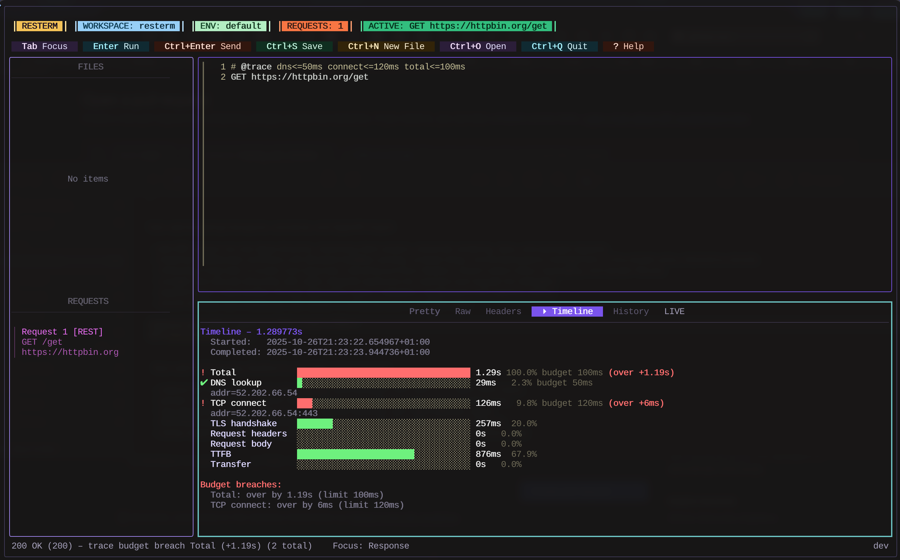

<h1 align="center">Resterm</h1>

<p align="center">
  <em>a terminal-based REST/GraphQL/gRPC/WebSocket/SSE client.</em>
</p>

<p align="center">
  
</p>

<p align="center">
  <strong>Trace and Timeline</strong>
</p>

<p align="center">
  
</p>

<p align="center">
  <strong>Workflow and WebSocket</strong>
</p>

<p align="center">
  
</p>

<p align="center">
  <strong>Compare mode</strong>
</p>

<p align="center">
  
</p>

<p align="center">
  <strong>Profiler</strong>
</p>

<p align="center">
  
</p>


Resterm is a terminal client for working with **HTTP**, **GraphQL**, and **gRPC** services. No cloud sync, no signups, no heavy desktop app, no bullshit.
It pairs a Vim-like-style editor with a workspace explorer, response diff, history, profiler and scripting so you can iterate on requests without leaving the keyboard (no mouse support is a feature here).

## Index
**Up & Running**
- [Highlights](#highlights)
- [Installation](#installation)
  - [Quick Install](#quick-install)
  - [Manual Installation](#manual-installation)
- [Update](#update)
- [Quick Start](#quick-start)
- [Quick Configuration Overview](#quick-configuration-overview)

---

**Deep dive**
- [Workflows](#workflows)
- [Compare Runs](#compare-runs)
- [Tracing & Timeline](#tracing--timeline)
- [OpenAPI imports](#openapi-imports)
- [Streaming (WebSocket & SSE)](#streaming-websocket--sse)
  - [Server-Sent Events](#server-sent-events)
  - [WebSockets](#websockets)
  - [Stream viewer & console](#stream-viewer--console)
- [Custom themes](#custom-themes)
- [Custom bindings](#custom-bindings)
- [Documentation](#documentation)

## Highlights
- **Workspace** navigator that filters `.http` / `.rest` files, supports recursion and keeps request lists in sync as you edit.
- **Editor** with inline syntax highlighting, search (`Ctrl+F`), clipboard motions, and inline metadata completions (type `@` for contextual hints).
- **Variable** scopes with `@global` (environment-wide), `@var file` (document), `@var request` (per-call), plus compile-time constants (`@const`), captures, JavaScript hooks, and multi-step workflows with per-step expectations and overrides.
- **GraphQL** helpers (`@graphql`, `@variables`, `@query`) and gRPC directives (`@grpc`, `@grpc-descriptor`, reflection, metadata).
- **WebSockets and SSE** with scripted `@ws` steps, automatic transcripts and an interactive console for ad-hoc frames.
- **OpenAPI importer** converts OpenAPI specs into Resterm-ready `.http` collections from the CLI.
- **Inline** requests and **curl** import for one-off calls (`Ctrl+Enter` on a URL or curl block).
- **Pretty/Raw/Header/Diff/History/Stream** views with optional split panes, pinned comparisons, and live event playback.
- **Built-in** OAuth 2.0 client plus support for basic, bearer, API key, and custom header auth.
- **Latency** with `@profile` to benchmark endpoints and render histograms right inside the TUI.
- **Tracing and Timeline** with `@trace` to enable request tracing.
- **Multi-step workflows** let you compose several named requests into one workflow (`@workflow` + `@step`), override per-step variables, and review aggregated results in History.
- **Multi-environment compare** via `@compare` directives or the global `--compare` flag + `g+c` shortcut so you can run the same request across diffrent envs. (dev/stage/prod etc.)

## Installation

### Quick Install

**Linux / macOS:**

> [!IMPORTANT]
> Pre-built Linux binaries depend on glibc **2.32 or newer**. If you run an older distro, build from source on a machine with a newer glibc toolchain or upgrade glibc before using the release archives.

```bash
curl -fsSL https://raw.githubusercontent.com/unkn0wn-root/resterm/main/install.sh | bash
```

or with `wget`:

```bash
wget -qO- https://raw.githubusercontent.com/unkn0wn-root/resterm/main/install.sh | bash
```

**Windows (PowerShell):**

```powershell
iwr -useb https://raw.githubusercontent.com/unkn0wn-root/resterm/main/install.ps1 | iex
```

These scripts will automatically detect your architecture, download the latest release, and install the binary.

### Manual Installation

> [!NOTE]
> The manual install helper uses `curl` and `jq`. Install `jq` with your package manager (`brew install jq`, `sudo apt install jq`, etc.).

#### Linux / macOS

```bash
# Detect latest tag
LATEST_TAG=$(curl -fsSL https://api.github.com/repos/unkn0wn-root/resterm/releases/latest | jq -r .tag_name)

# Download the matching binary (Darwin/Linux + amd64/arm64)
curl -fL -o resterm "https://github.com/unkn0wn-root/resterm/releases/download/${LATEST_TAG}/resterm_$(uname -s)_$(uname -m)"

# Make it executable and move it onto your PATH
chmod +x resterm
sudo install -m 0755 resterm /usr/local/bin/resterm
```

#### Windows (PowerShell)

```powershell
$latest = Invoke-RestMethod https://api.github.com/repos/unkn0wn-root/resterm/releases/latest
$asset  = $latest.assets | Where-Object { $_.name -like 'resterm_Windows_*' } | Select-Object -First 1
Invoke-WebRequest -Uri $asset.browser_download_url -OutFile resterm.exe
# Optionally relocate to a directory on PATH, e.g.:
Move-Item resterm.exe "$env:USERPROFILE\bin\resterm.exe"
```

#### From source

```bash
go install github.com/unkn0wn-root/resterm/cmd/resterm@latest
```

## Update

```bash
resterm --check-update
resterm --update
```

The first command reports whether a newer release is available; the second downloads and installs it (Windows users receive a staged binary to swap on restart).

## Quick Start

1. Create or open a directory that contains `.http` / `.rest` files (see `_examples/` for samples). If you want to start right away without any .http - just open resterm...
2. ... or launch Resterm: `resterm --workspace path/to/project` (or if your .http/.rest file is in the same dir. - just type `resterm` and it will be autodiscovered).
3. Pick a request from the sidebar and press `Ctrl+Enter` to send it. Responses appear in the right pane. If you don't have any .http file, just switch to the editor (`Tab`) and type `https://<some_url_dot_something>` and press `Ctrl+Enter`.
4. Move between panes with `Tab` / `Shift+Tab`, jump directly with `g+r` (requests), `g+i` (editor), `g+p` (response), adjust the focused pane layout with `g+h` / `g+l` (sidebar width when the left pane is focused, editor/response split otherwise), and toggle the response pane between inline and stacked with `g+v` / `g+s`. Use `g+1`, `g+2`, and `g+3` to minimize/restore the sidebar, editor, and response panes respectively, and `g+z` / `g+Z` to zoom the focused pane and clear the zoom.
5. Use `Ctrl+E` to switch environments, `Ctrl+G` to inspect captured globals, and `Ctrl+V` / `Ctrl+U` to split the response pane when comparing calls. When the response pane is focused, `Ctrl+Shift+C` (or `g y`) copies the entire Pretty/Raw/Headers tab into your clipboard without needing a mouse selection.

A minimal request file:

```http
### Status check
# @name status
GET https://httpbin.org/status/204
User-Agent: resterm

### Authenticated echo
# @name bearerEcho
# @auth bearer {{auth.token}}
GET https://httpbin.org/bearer
Accept: application/json
```

## Inline curl import

Drop a curl command into the editor and press `Ctrl+Enter` anywhere inside to turn it into a structured request. Resterm understands common flags (`-X`, `-H`, `--data*`, `--json`, `--url`, `--user`, `--compressed`, `-F/--form`, etc.), merges repeated data segments, and respects multipart uploads.

```bash
curl \
  --compressed \
  --url "https://httpbin.org/post?source=resterm&case=multipart" \
  --request POST \
  -H "Accept: application/json" \
  -H "X-Client: resterm-dev" \
  --user resterm:test123 \
  -F file=@README.md \
  --form-string memo='Testing resterm inline curl
with multiline value' \
  --form-string meta='{"env":"test","attempt":1}'
```

If you copied the command from a shell, prefixes like `sudo` or `$` are ignored automatically. Resterm loads the file attachment, preserves multiline form fields, and applies compression/auth headers without extra tweaks.

## Quick Configuration Overview

- Environment files: `resterm.env.json` (or legacy `rest-client.env.json`) discovered in the file directory, workspace root, or current working directory. Explicit dotenv files (`.env`, `.env.*`, `*.env`) are supported via `--env-file` only; we derive the environment name from a `workspace` entry, then the file stem, falling back to `default` for bare `.env` files. Important: Dotenv loading is **single-workspace** for now. Use JSON when you need multiple environments in one file.
- CLI flags: `--workspace`, `--file`, `--env`, `--env-file`, `--timeout`, `--insecure`, `--follow`, `--proxy`, `--recursive`, `--from-openapi`, `--http-out`, `--openapi-base-var`, `--openapi-resolve-refs`, `--openapi-include-deprecated`, `--openapi-server-index`.
- Config directory: `$HOME/Library/Application Support/resterm`, `%APPDATA%\resterm`, or `$HOME/.config/resterm` (override with `RESTERM_CONFIG_DIR`).
- Themes: add `.toml` or `.json` files under `~/.config/resterm/themes` (override with `RESTERM_THEMES_DIR`) and switch them at runtime with `Ctrl+Alt+T` (or chord `g` then `t`).

## Workflows

- Combine existing requests with `@workflow` + `@step` blocks to build repeatable scenarios that run inside the TUI.
- Set per-step assertions (`expect.status`, `expect.statuscode`) and pass data between steps via `vars.request.*` and `vars.workflow.*` namespaces.
- View progress in the sidebar, and inspect the aggregated summary in History after the run.
- See [`docs/resterm.md`](./docs/resterm.md#workflows-multi-step-workflows) for the full reference and `_examples/workflows.http` for a runnable sample workflow.

## Compare Runs

> Try `_examples/compare.http` to see `@compare` directives and the `g+c` shortcut in action (pair it with `resterm --compare dev,stage,prod` for instant multi-environment sweeps).

Modern API work rarely stops at a single environment, so Resterm bakes in a compare workflow that takes seconds to use:

1. Add `# @compare dev stage prod base=stage` to any request (or launch the app with `--compare dev,stage,prod --compare-base stage`).
2. Press `g+c` (or `Enter` if you mapped the command) to send the current request to every listed environment. Resterm flips into a split view automatically so you can watch progress live.
3. When the run finishes, move to the Compare tab and use the arrow keys (PgUp/PgDn/Home/End work too) to highlight any environment. Press `Enter` and the primary pane shows that environment, the secondary pane pins the baseline and you land in the Diff tab so Pretty/Raw/Headers all reflect selected ↔ baseline.
4. Loading a compare entry from History gives the same experience even if you are offline. Resterm rehydrates the snapshots so you can keep auditing deltas without rerunning requests.

For more info. about compare runs, see [docs/resterm.md#compare-runs](./docs/resterm.md#compare-runs).

## Tracing & Timeline

- Enable per-phase network tracing by adding `# @trace` metadata to a request. Budgets use `phase<=duration` syntax (for example `dns<=50ms total<=300ms tolerance=25ms`). Supported phases mirror the HTTP client hooks: `dns`, `connect`, `tls`, `request_headers`, `request_body`, `ttfb`, `transfer`, and `total`.
- When a traced response arrives, a **Timeline** tab appears beside Pretty/Raw/Headers. It renders a proportional bar chart, annotates overruns, and lists budget breaches. Jump straight to it with `Ctrl+Alt+L` (or the `g+t` chord) and exit via the standard tab navigation.
- Trace data is available to scripts through the `trace` binding (`trace.enabled()`, `trace.phases()`, `trace.breaches()`, `trace.withinBudget()`, etc.), making CI assertions straightforward.
- `_examples/trace.http` contains two runnable requests (one within budget, one intentionally breaching) for quick experimentation.
- Resterm can export spans to OpenTelemetry when `RESTERM_TRACE_OTEL_ENDPOINT` (or `--trace-otel-endpoint`) is set. Optional extras: `RESTERM_TRACE_OTEL_INSECURE` / `--trace-otel-insecure`, `RESTERM_TRACE_OTEL_SERVICE` / `--trace-otel-service`, `RESTERM_TRACE_OTEL_TIMEOUT`, and `RESTERM_TRACE_OTEL_HEADERS`.
- Spans are emitted only when tracing is enabled. Budget breaches and HTTP failures automatically mark spans with an error status so distributed traces surface anomalies clearly.

Deep dive into budgets, keyboard shortcuts, and trace scripting in [docs/resterm.md#timeline--tracing](./docs/resterm.md#timeline--tracing).

## OpenAPI imports

Resterm can translate an OpenAPI 3 specification into a `.http` collection directly from the CLI.

```bash
resterm \
  --from-openapi openapi-test.yml \
  --http-out openapi-test.http \
  --openapi-base-var apiBase \
  --openapi-resolve-refs \
  --openapi-server-index 1
```

- `--from-openapi` points at the source spec, `--http-out` controls the generated `.http` file (defaults to `<spec>.http` when omitted).
- `--openapi-base-var` overrides the variable name injected for the base URL (falls back to `baseUrl`).
- `--openapi-resolve-refs` enables kin-openapi's `$ref` resolution before generation.
- `--openapi-include-deprecated` keeps deprecated operations that are skipped by default.
- `--openapi-server-index` picks which server entry (0-based) should populate the base URL if multiple servers are defined.

The repository ships with `openapi-specs.yml`, an intentionally full-featured spec that covers array/object query parameters, callbacks, and unsupported constructs (for example OpenID Connect). Those unsupported pieces surface as `Warning:` lines within the generated header comment so you can verify warning handling end-to-end.

> [!NOTE]
> Resterm relies on [`kin-openapi`](https://github.com/getkin/kin-openapi), which currently supports OpenAPI documents up to **v3.0.1**. Work on v3.1 support is tracked in [getkin/kin-openapi#1102](https://github.com/getkin/kin-openapi/pull/1102).

More about OpenAPI importer and available flags in [docs/resterm.md#importing-openapi-specs](./docs/resterm.md#importing-openapi-specs).

## Streaming (WebSocket & SSE)

Streaming requests are first-class citizens in Resterm. Enable the **Stream** response tab to watch events in real time. See [docs/resterm.md#streaming-sse--websocket](./docs/resterm.md#streaming-sse--websocket) for the complete directive list.

### Server-Sent Events

Annotate any HTTP request with `# @sse` to keep the connection open and capture events:

```http
### Notification feed
# @name streamNotifications
# @sse duration=1m idle=5s max-events=50
GET https://api.example.com/notifications
Accept: text/event-stream
```

`@sse` accepts:

- `duration` / `timeout` total session timeout before Resterm aborts the stream.
- `idle` / `idle-timeout` maximum gap between events before the stream is closed.
- `max-events` stop after N events (Resterm still records the transcript).
- `max-bytes` / `limit-bytes` cap downloaded payload size.

The Pretty/Raw/Headers tabs collapse into a JSON transcript when a stream finishes and the history entry exposes a summary (`events`, `bytes`, `reason`). More SSE options and transcript fields live in [docs/resterm.md#server-sent-events-sse](./docs/resterm.md#server-sent-events-sse).

### WebSockets

Switch any request to WebSocket mode with `# @websocket` and describe scripted steps with `# @ws` lines:

```http
### Chat handshake
# @name websocketChat
# @websocket timeout=10s receive-timeout=5s subprotocols=chat.v2,json
# @ws send {"type":"hello"}
# @ws wait 1s
# @ws send-json {"type":"message","text":"Hi"}
# @ws close 1000 "client done"
wss://chat.example.com/stream
```

or if you prefer just to open websocket connection:
```http
### Chat
# @name websocketChat
# @websocket
ws://chat.example.com/stream
```

WebSocket options mirror runtime controls:

- `timeout` - handshake deadline.
- `receive-timeout` - idle receive window (0 keeps it open indefinitely).
- `max-message-bytes` - hard cap for inbound payloads.
- `subprotocols` - comma-separated list sent during the handshake.
- `compression=<true|false>` - explicitly enable or disable per-message compression.

Each `@ws` directive emits a step:

- `send`/`send-json`/`send-base64`/`send-file` send text, JSON, base64, or file payloads.
- `ping` / `pong` transmit control frames.
- `wait <duration>` pauses before the next scripted action.
- `close [code] [reason]` ends the session with an optional status.

The transcript records sender/receiver, opcode, sizes, close metadata and elapsed time. History entries keep the conversation for later review or scripted assertions. See [docs/resterm.md#websockets-websocket-ws](./docs/resterm.md#websockets-websocket-ws).

### Stream viewer & console

- Focus the response pane with `g+p`, then switch to the Stream tab using the left/right arrow keys (or `Ctrl+H` / `Ctrl+L`). Follow events live, bookmark frames and scrub after the stream completes.
- Toggle the interactive WebSocket console with `Ctrl+I` or `g+r` while the Stream tab is focused. Use `F2` to cycle payload modes (text, JSON, base64, file), `Ctrl+S` (or `Ctrl+Enter`) to send, arrows to navigate history, `Ctrl+P` for ping, `Ctrl+W` to close and `Ctrl+L` to clear the buffer.
- Scripted tests can consume transcripts via the `stream` API (`stream.kind`, `stream.summary`, `stream.events`, `stream.onEvent()`), enabling assertions on streaming workloads.
Find every stream history/export hook in [docs/resterm.md#stream-tab-history-and-console](./docs/resterm.md#stream-tab-history-and-console).

## Custom themes

Resterm ships with a default palette, but you can provide your own by dropping theme definitions into the themes directory mentioned above. Each theme can be written in TOML or JSON and only needs to override the parts you care about.

A ready-to-use sample lives in [_examples/themes/aurora.toml](_examples/themes/aurora.toml). Point `RESTERM_THEMES_DIR` env var at that folder to try it immediately.

```toml
[metadata]
name = "Oceanic"
author = "You"

[styles.header_title]
foreground = "#5fd1ff"
bold = true

[colors]
pane_active_foreground = "#5fd1ff"
pane_border_focus_file = "#1f6feb"
```

Save the file as `~/.config/resterm/themes/oceanic.toml` (or to your `RESTERM_THEMES_DIR`) and press `Ctrl+Alt+T` (or type `g` then `t`) inside Resterm to pick it as the default. The selected theme is persisted to `settings.toml` so it is restored on the next launch. The theming primer (directory layout, schema, and testing tips) lives in [docs/resterm.md#theming](./docs/resterm.md#theming).

## Custom bindings

Resterm looks for `${RESTERM_CONFIG_DIR}/bindings.toml` first (and `bindings.json` second). Each entry maps an action ID to one or more bindings:

```toml
[bindings]
save_file = ["ctrl+shift+s"]
set_main_split_horizontal = ["g s", "ctrl+alt+s"]
send_request = ["ctrl+enter", "cmd+enter"]
```

- Modifiers use `+` (`ctrl+shift+o`), while chord steps are separated by spaces (`"g s"`).
- Only up to two steps are supported; `send_request` must stay single-step so it can fire while you type.
- Unknown actions or two actions sharing the same binding will be rejected (Resterm logs the error and keeps defaults).

The complete action catalog and a binding reference live in [docs/resterm.md#custom-bindings](docs/resterm.md#custom-bindings).

Check out the sample in [_examples/bindings/bindings.toml](_examples/bindings/bindings.toml)

## Documentation

The full reference, including request syntax, metadata, directive tables, scripting APIs, transport settings and advanced workflows, lives in [`docs/resterm.md`](./docs/resterm.md).
