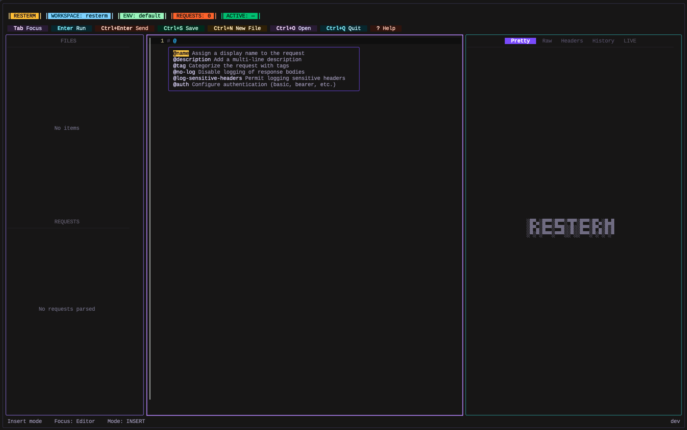
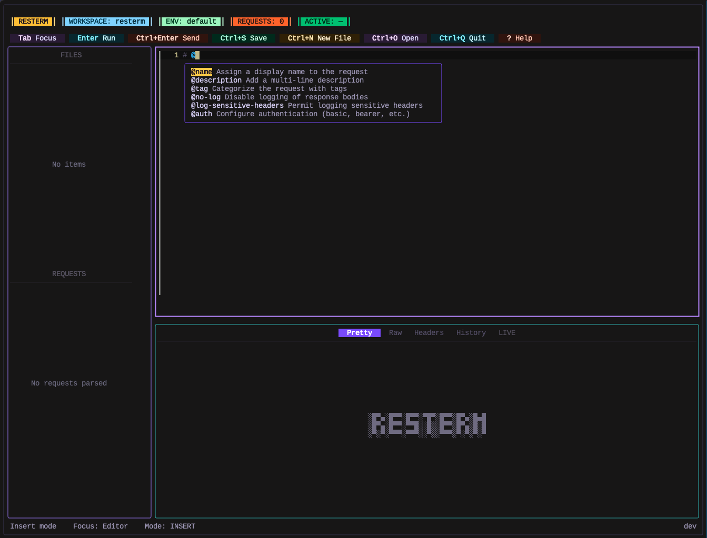
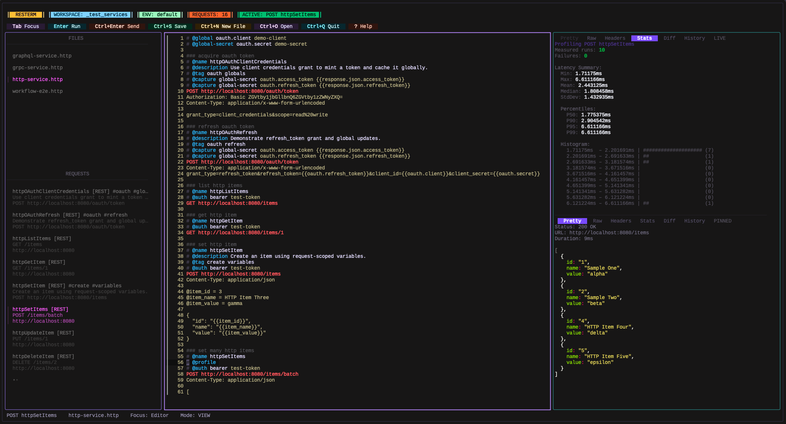

<h1 align="center">Resterm</h1>

<p align="center">
  <em>a terminal-based REST/GraphQL/gRPC client.</em>
</p>

<p align="center">
  
</p>

<p align="center">
  <strong>split in horizontal view</strong>
</p>

<p align="center">
  
</p>

<p align="center">
  <strong>split panes with response diffing side-by-side</strong>
</p>

<p align="center">
  
</p>

<p align="center">
  <strong>Split panes response and profiler</strong>
</p>

<p align="center">
  
</p>

<p align="center">
  <strong>Workflow run with step-by-step validation</strong>
</p>

<p align="center">
  
</p>

Resterm is a terminal-first client for working with **HTTP**, **GraphQL**, and **gRPC** services. No cloud sync, no signups, no heavy desktop app. Simple, yet feature rich, terminal client for .http/.rest files.
It pairs a Vim-like-style editor with a workspace explorer, response diff, history, profiler and scripting so you can iterate on requests without leaving the keyboard.

## Highlights
- **Editor** with inline syntax highlighting, search (`Ctrl+F`), clipboard motions, and inline metadata completions (type `@` for contextual hints).
- **Workspace** navigator that filters `.http` / `.rest` files, supports recursion and keeps request lists in sync as you edit.
- **Inline** requests and **curl** import for one-off calls (`Ctrl+Enter` on a URL or curl block).
- **Pretty/Raw/Header/Diff/History** views with optional split panes and pinned comparisons.
- **Variable** scopes, captures, JavaScript hooks, and multi-step workflows with per-step expectations and overrides.
- **GraphQL** helpers (`@graphql`, `@variables`, `@query`) and gRPC directives (`@grpc`, `@grpc-descriptor`, reflection, metadata).
- **Built-in** OAuth 2.0 client plus support for basic, bearer, API key, and custom header auth.
- **Latency** with `@profile` to benchmark endpoints and render histograms right inside the TUI.
- **Multi-step workflows** let you compose several named requests into one workflow (`@workflow` + `@step`), override per-step variables, and review aggregated results in History.

## Installation

### Quick Install

**Linux / macOS:**

```bash
curl -fsSL https://raw.githubusercontent.com/unkn0wn-root/resterm/main/install.sh | bash
```

or with `wget`:

```bash
wget -qO- https://raw.githubusercontent.com/unkn0wn-root/resterm/main/install.sh | bash
```

**Windows (PowerShell):**

```powershell
iwr -useb https://raw.githubusercontent.com/unkn0wn-root/resterm/main/install.ps1 | iex
```

These scripts will automatically detect your architecture, download the latest release, and install the binary.

### Manual Installation

> [!NOTE]
> The manual install helper uses `curl` and `jq`. Install `jq` with your package manager (`brew install jq`, `sudo apt install jq`, etc.).

#### Linux / macOS

```bash
# Detect latest tag
LATEST_TAG=$(curl -fsSL https://api.github.com/repos/unkn0wn-root/resterm/releases/latest | jq -r .tag_name)

# Download the matching binary (Darwin/Linux + amd64/arm64)
curl -fL -o resterm "https://github.com/unkn0wn-root/resterm/releases/download/${LATEST_TAG}/resterm_$(uname -s)_$(uname -m)"

# Make it executable and move it onto your PATH
chmod +x resterm
sudo install -m 0755 resterm /usr/local/bin/resterm
```

#### Windows (PowerShell)

```powershell
$latest = Invoke-RestMethod https://api.github.com/repos/unkn0wn-root/resterm/releases/latest
$asset  = $latest.assets | Where-Object { $_.name -like 'resterm_Windows_*' } | Select-Object -First 1
Invoke-WebRequest -Uri $asset.browser_download_url -OutFile resterm.exe
# Optionally relocate to a directory on PATH, e.g.:
Move-Item resterm.exe "$env:USERPROFILE\bin\resterm.exe"
```

#### From source

```bash
go install github.com/unkn0wn-root/resterm/cmd/resterm@latest
```

## Update

```bash
resterm --check-update
resterm --update
```

The first command reports whether a newer release is available; the second downloads and installs it (Windows users receive a staged binary to swap on restart).

## Quick Start

1. Create or open a directory that contains `.http` / `.rest` files (see `_examples/` for samples). If you want to start right away without any .http - just open resterm...
2. ... or launch Resterm: `resterm --workspace path/to/project` (or if your .http/.rest file is in the same dir. - just type `resterm` and it will be autodiscovered).
3. Pick a request from the sidebar and press `Ctrl+Enter` to send it. Responses appear in the right pane. If you don't have any .http file, just switch to the editor (`Tab`) and type `https://<some_url_dot_something>` and press `Ctrl+Enter`.
4. Move between panes with `Tab` / `Shift+Tab`, jump directly with `g+r` (requests), `g+i` (editor), `g+p` (response), adjust the focused pane layout with `g+h` / `g+l` (sidebar width when the left pane is focused, editor/response split otherwise), and toggle the response pane between inline and stacked with `g+v` / `g+s`.
5. Use `Ctrl+E` to switch environments, `Ctrl+G` to inspect captured globals, and `Ctrl+V` / `Ctrl+U` to split the response pane when comparing calls.

A minimal request file:

```http
### Status check
# @name status
GET https://httpbin.org/status/204
User-Agent: resterm

### Authenticated echo
# @name bearerEcho
# @auth bearer {{auth.token}}
GET https://httpbin.org/bearer
Accept: application/json
```

### Inline curl import

Drop a curl command into the editor and press `Ctrl+Enter` anywhere inside to turn it into a structured request. Resterm understands common flags (`-X`, `-H`, `--data*`, `--json`, `--url`, `--user`, `--compressed`, `-F/--form`, etc.), merges repeated data segments, and respects multipart uploads.

```bash
curl \
  --compressed \
  --url "https://httpbin.org/post?source=resterm&case=multipart" \
  --request POST \
  -H "Accept: application/json" \
  -H "X-Client: resterm-dev" \
  --user resterm:test123 \
  -F file=@README.md \
  --form-string memo='Testing resterm inline curl
with multiline value' \
  --form-string meta='{"env":"test","attempt":1}'
```

If you copied the command from a shell, prefixes like `sudo` or `$` are ignored automatically. Resterm loads the file attachment, preserves multiline form fields, and applies compression/auth headers without extra tweaks.

## Workflows

- Combine existing requests with `@workflow` + `@step` blocks to build repeatable scenarios that run inside the TUI.
- Set per-step assertions (`expect.status`, `expect.statuscode`) and pass data between steps via `vars.request.*` and `vars.workflow.*` namespaces.
- View progress in the sidebar, and inspect the aggregated summary in History after the run.
- See [`docs/resterm.md`](./docs/resterm.md#workflows-multi-step-workflows) for the full reference and `_examples/workflows.http` for a runnable sample workflow.

## Quick Configuration Overview

- Environment files: `resterm.env.json` (or legacy `rest-client.env.json`) discovered in the file directory, workspace root, or current working directory.
- CLI flags: `--workspace`, `--file`, `--env`, `--env-file`, `--timeout`, `--insecure`, `--follow`, `--proxy`, `--recursive`.
- Config directory: `$HOME/Library/Application Support/resterm`, `%APPDATA%\resterm`, or `$HOME/.config/resterm` (override with `RESTERM_CONFIG_DIR`).
- Themes: add `.toml` or `.json` files under `~/.config/resterm/themes` (override with `RESTERM_THEMES_DIR`) and switch them at runtime with `Ctrl+Alt+T` (or chord `g` then `t`).

### Custom themes

Resterm ships with a default palette, but you can provide your own by dropping theme definitions into the themes directory mentioned above. Each theme can be written in TOML or JSON and only needs to override the parts you care about.

A ready-to-use sample lives in `_examples/themes/aurora.toml`. Point `RESTERM_THEMES_DIR` env var at that folder to try it immediately.

```toml
[metadata]
name = "Oceanic"
author = "You"

[styles.header_title]
foreground = "#5fd1ff"
bold = true

[colors]
pane_active_foreground = "#5fd1ff"
pane_border_focus_file = "#1f6feb"
```

Save the file as `~/.config/resterm/themes/oceanic.toml` (or to your `RESTERM_THEMES_DIR`) and press `Ctrl+Alt+T` (or type `g` then `t`) inside Resterm to pick it as the default. The selected theme is persisted to `settings.toml` so it is restored on the next launch.

## Documentation

The full reference, including request syntax, metadata, directive tables, scripting APIs, transport settings and advanced workflows, lives in [`docs/resterm.md`](./docs/resterm.md).
