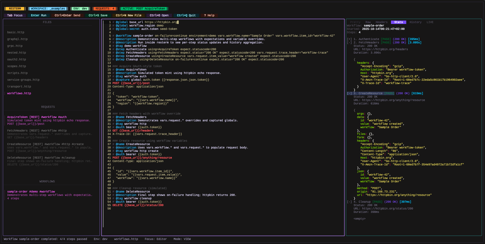

<h1 align="center">Resterm</h1>

<p align="center">
  <em>A terminal-first client for REST, GraphQL, gRPC, WebSocket, and SSE.</em>
</p>

<p align="center">
  
</p>

Resterm is a **keyboard-driven** API client that lives in your terminal and keeps everything local. It stores requests as plain files, supports **SSH tunnels** and **OAuth 2.0**, and gives you a fast feedback loop with `history`, `diffs`, `tracing`, and `profiling`.

Quick links: [Screenshots](#screenshot-tour), [Installation](#installation), [Quick Start](#quick-start),[Features](#overview), and [Documentation](#documentation).

## Why Resterm

- Requests live in plain `.http` / `.rest` files.
- Requests are declarative, so you describe what should happen in files and Resterm executes it the same way every time, more like a small API language than a one-off UI.
- The UI is fully keyboard-driven.
- OAuth 2.0 flows and SSH tunnels are built in so no extra tools are needed.
- Timeline tracing, profiling, and streaming transcripts make debugging first-class.
- Resterm is meant to be Git-driven so cloud sync and accounts are avoided by default.
- There is no AI integration and there will never be.

## Screenshot tour

<details>
<summary>See the UI in action</summary>

<p align="center">
  <strong>Workflows</strong>
</p>

<p align="center">
  
</p>

<p align="center">
  <strong>Trace and Timeline</strong>
</p>

<p align="center">
  
</p>

<p align="center">
  <strong>Profiler</strong>
</p>

<p align="center">
  
</p>

<p align="center">
  <strong>RestermScript</strong>
</p>

<p align="center">
  
</p>

<p align="center">
  <strong>OAuth browser demo (old UI design)</strong>
</p>

<p align="center">
  
</p>

</details>

## Quick Start

1. Install Resterm using the command that matches your OS.

   ```bash
   # Linux/macOS (Homebrew)
   brew install resterm

   # Linux (install script)
   curl -fsSL https://raw.githubusercontent.com/unkn0wn-root/resterm/main/install.sh | bash
   ```

   ```powershell
   # Windows (PowerShell)
   iwr -useb https://raw.githubusercontent.com/unkn0wn-root/resterm/main/install.ps1 | iex
   ```

2. Bootstrap a tiny workspace.

   ```bash
   mkdir my-api && cd my-api
   resterm init
   ```

3. Run it and send your first request.

   ```bash
   resterm
   ```

   Press `Ctrl+Enter` in the editor to send the highlighted request.

If you do not want files yet, just run `resterm`, type a URL in the editor, and press `Ctrl+Enter`.
If you already have a curl command, paste it into the editor and press `Ctrl+Enter` to import it.

## Key files

These are the files you will see most often in a Resterm workspace.

- `.http` / `.rest` files store your requests, metadata, and named steps.
- `resterm.env.json` holds environment variables and secrets for one or more environments.
- `resterm.env.example.json` is a safe template you can commit and share.
- `.rts` files contain RestermScript helpers for reuse and small bits of logic.
- `RESTERM.md` is optional project notes created by `resterm init`.

## Overview

Protocols and transports cover the following.

- HTTP, GraphQL, gRPC, WebSocket, and SSE are supported out of the box.
- SSH tunnels include host key verification, keep-alives, retries, and persistent sessions.

Workspace and files focus on the following.

- `.http` / `.rest` files are discovered automatically and the request list stays in sync as you edit.
- The request editor includes inline syntax highlighting, search, and contextual metadata hints.
- Environment files are treated as first-class input. `resterm init` adds _resterm.env.json_ to _.gitignore_ but any custom env files passed via the CLI are **not** ignored automatically.

Automation and reuse include the following.

- Variables, captures, constants, and multi-step workflows.
- RestermScript (RTS) and optional JavaScript hooks handle request-time logic.
- Curl commands and OpenAPI specs can be imported directly into request collections.

Debugging and inspection provide the following.

- Pretty/raw/header/diff/history views are available with split panes.
- Streaming transcripts are recorded and an interactive console is available for WebSocket and SSE.
- Timeline tracing and profiling help find slow or flaky endpoints.

Security and auth cover the following.

- OAuth 2.0 client credentials, password grant, and authorization code + PKCE are supported.
- Tokens are cached per environment and refreshed automatically.

Customization includes the following.

- Custom themes and keybindings.

## Navigation & layout cheat sheet

A few keys that make Resterm feel “native” quickly:

- **Pane focus & layout**
  - `Tab` / `Shift+Tab` - move focus between sidebar, editor, and response.
  - `g+r` - jump to **Requests** (sidebar).
  - `g+i` - jump to **Editor**.
  - `g+p` - jump to **Response**.
  - `g+h` / `g+l` - adjust layout:
    - When the **left pane** (sidebar) is focused: change sidebar width.
    - Otherwise: change editor/response split.
  - `g+v` / `g+s` - toggle response pane between inline and stacked layout.
  - `g+1`, `g+2`, `g+3` + minimize/restore sidebar, editor, response.
  - `g+z` / `g+Z` - zoom the focused pane / clear zoom.

- **Environments & globals**
  - `Ctrl+E` - switch environments.
  - `Ctrl+G` - inspect captured globals.

- **Working with responses**
  - `Ctrl+V` / `Ctrl+U` - split the response pane for side-by-side comparison.
  - When response pane is focused:
    - `Ctrl+Shift+C` or `g y` - copy the entire Pretty/Raw/Headers tab
      to the clipboard (no mouse selection needed).

---

> [!TIP]
> **If you only remember three shortcuts…**
> - `Ctrl+Enter` - send request
> - `Tab` / `Shift+Tab` - switch panes
> - `g+p` - jump to response

## Installation

**Linux / macOS (Homebrew)**

```bash
brew install resterm
```

> [!NOTE]
> Homebrew installs should be updated with Homebrew (`brew upgrade resterm`). The built-in `resterm --update` command is for binaries installed from GitHub releases or install scripts.

**Linux / macOS (Shell script)**

> [!IMPORTANT]
> Pre-built Linux binaries depend on glibc **2.32 or newer**. If you run an older distro, build from source on a machine with a newer glibc toolchain or upgrade glibc before using the release archives.

```bash
curl -fsSL https://raw.githubusercontent.com/unkn0wn-root/resterm/main/install.sh | bash
```

or with `wget`:

```bash
wget -qO- https://raw.githubusercontent.com/unkn0wn-root/resterm/main/install.sh | bash
```

**Windows (PowerShell)**

```powershell
iwr -useb https://raw.githubusercontent.com/unkn0wn-root/resterm/main/install.ps1 | iex
```

These scripts detect your architecture, download the latest release, and install the binary.

### Manual installation

> [!NOTE]
> The manual install helper uses `curl` and `jq`. Install `jq` with your package manager (`brew install jq`, `sudo apt install jq`, etc.).

**Linux / macOS**

```bash
# Detect latest tag
LATEST_TAG=$(curl -fsSL https://api.github.com/repos/unkn0wn-root/resterm/releases/latest | jq -r .tag_name)

# Download the matching binary (Darwin/Linux + amd64/arm64)
curl -fL -o resterm "https://github.com/unkn0wn-root/resterm/releases/download/${LATEST_TAG}/resterm_$(uname -s)_$(uname -m)"

# Make it executable and move it onto your PATH
chmod +x resterm
sudo install -m 0755 resterm /usr/local/bin/resterm
```

**Windows (PowerShell)**

```powershell
$latest = Invoke-RestMethod https://api.github.com/repos/unkn0wn-root/resterm/releases/latest
$asset  = $latest.assets | Where-Object { $_.name -like 'resterm_Windows_*' } | Select-Object -First 1
Invoke-WebRequest -Uri $asset.browser_download_url -OutFile resterm.exe
# Optionally relocate to a directory on PATH, e.g.:
Move-Item resterm.exe "$env:USERPROFILE\bin\resterm.exe"
```

### From source

```bash
go install github.com/unkn0wn-root/resterm/cmd/resterm@latest
```

## Update

```bash
resterm --check-update
resterm --update
```

The first command reports whether a newer release is available. The second downloads and installs it (Windows users receive a staged binary to swap on restart).

## Quick Configuration Overview

- Environments are JSON files (`resterm.env.json`) discovered in the request directory, workspace root, or CWD. Dotenv files (`.env`, `.env.*`) are opt-in via `--env-file` and are single-workspace. Prefer JSON when you need multiple environments in one file.
- Flags you probably reach for most are `--workspace`, `--file`, `--env`, `--env-file`, `--timeout`, `--insecure`, `--follow`, `--proxy`, `--recursive`, `--from-curl`, `--from-openapi`, and `--http-out`.
- Config is stored at `$HOME/Library/Application Support/resterm`, `%APPDATA%\resterm`, or `$HOME/.config/resterm` and can be overridden with `RESTERM_CONFIG_DIR`.

## Inline curl import

Paste a curl command into the editor and press `Ctrl+Enter` to convert it into a structured request. Resterm understands common flags, merges repeated data segments, and keeps multipart uploads intact.

```bash
curl \
  --compressed \
  --url "https://httpbin.org/post?source=resterm&case=multipart" \
  --request POST \
  -H "Accept: application/json" \
  -H "X-Client: resterm-dev" \
  --user resterm:test123 \
  -F file=@README.md \
  --form-string memo='Testing resterm inline curl
with multiline value' \
  --form-string meta='{"env":"test","attempt":1}'
```

If you copied the command from a shell, prefixes like `sudo` or `$` are ignored automatically.

## RestermScript

RestermScript (RTS) is a small expression language built specifically for Resterm. Because it targets Resterm features directly, it can evolve alongside Resterm and stay symbiotic with the request format, workflows, and directives. JavaScript hooks are still available when you want them, but RTS is the default because it is readable, predictable, and focused on Resterm’s domain.

Quick example (RTS module + request):

```rts
// rts/helpers.rts
module helpers
export fn authHeader(token) {
  return token ? "Bearer " + token : ""
}
```

```http
# @use ./rts/helpers.rts
# @when env.has("feature")
# @assert response.statusCode == 200
GET https://api.example.com/users/{{= vars.get("user") }}
Authorization: {{= helpers.authHeader(vars.get("auth.token")) }}
```

Full reference: [`docs/restermscript.md`](docs/restermscript.md).

## Deep dive

#### OAuth 2.0

Resterm supports client credentials, password grant, and authorization code + PKCE. For auth code flows, it opens your system browser, spins up a local callback server on `127.0.0.1`, captures the redirect, and exchanges the code automatically. Tokens are cached per environment and refreshed when they expire. Docs: [`docs/resterm.md#oauth-20-directive`](./docs/resterm.md#oauth-20-directive) and `_examples/oauth2.http`.

#### Workflows and scripting

Chain requests with `@workflow` and `@step`, pass data between steps, and add lightweight JS hooks where needed. Docs + sample: [`docs/resterm.md#workflows-multi-step-workflows`](./docs/resterm.md#workflows-multi-step-workflows) and `_examples/workflows.http`.

#### Compare runs

Run the same request across environments with `@compare` or `--compare`, then diff responses side by side with `g+c`. Docs: [`docs/resterm.md#compare-runs`](./docs/resterm.md#compare-runs).

#### Tracing and timeline

Add `@trace` with budgets to capture DNS, connect, TLS, TTFB, and transfer timings. Resterm visualizes overruns and can export spans to OpenTelemetry. Docs: [`docs/resterm.md#timeline--tracing`](./docs/resterm.md#timeline--tracing).

#### Streaming (WebSocket and SSE)

Use `@websocket` with `@ws` steps or `@sse` to script and record streams. The Stream tab keeps transcripts and includes an interactive console. Docs: [`docs/resterm.md#streaming-sse--websocket`](./docs/resterm.md#streaming-sse--websocket).

#### gRPC

Resterm supports unary and streaming calls with transcripts, metadata, and body expansion for gRPC files. Docs: [`docs/resterm.md#grpc`](./docs/resterm.md#grpc).

#### OpenAPI import

Convert OpenAPI 3 specs into Resterm-ready `.http` collections from the CLI with `--from-openapi`. Docs: [`docs/resterm.md#importing-openapi-specs`](./docs/resterm.md#importing-openapi-specs).

#### Curl import

Convert curl commands into `.http` files from the CLI with `--from-curl`. Docs: [`docs/resterm.md#importing-curl-commands`](./docs/resterm.md#importing-curl-commands).

#### SSH tunnels

Route HTTP, gRPC, WebSocket, and SSE traffic through bastions with `@ssh` profiles. Docs: [`docs/resterm.md#ssh-jumps`](./docs/resterm.md#ssh-tunnels) and `_examples/ssh.http`.

#### Theming and bindings

Customize colors and keybindings via `themes/*.toml` and `bindings.toml` or `bindings.json` under the config directory. Docs: [`docs/resterm.md#theming`](./docs/resterm.md#theming) and [`docs/resterm.md#custom-bindings`](./docs/resterm.md#custom-bindings).

## Documentation

The full reference, including request syntax, metadata, directive tables, scripting APIs, transport settings, and advanced workflows, lives in [`docs/resterm.md`](./docs/resterm.md).
